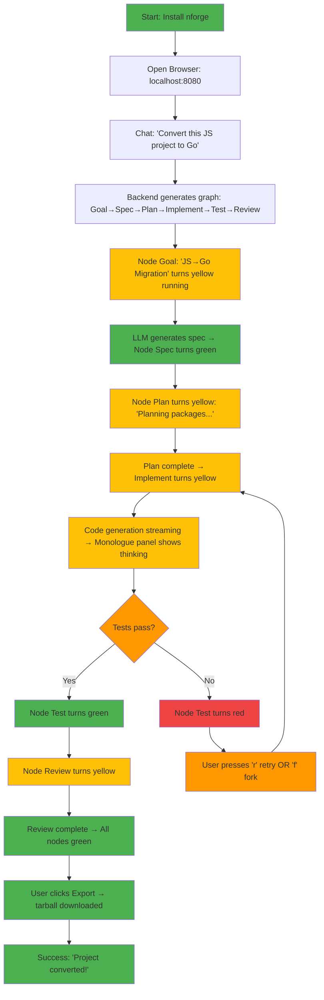
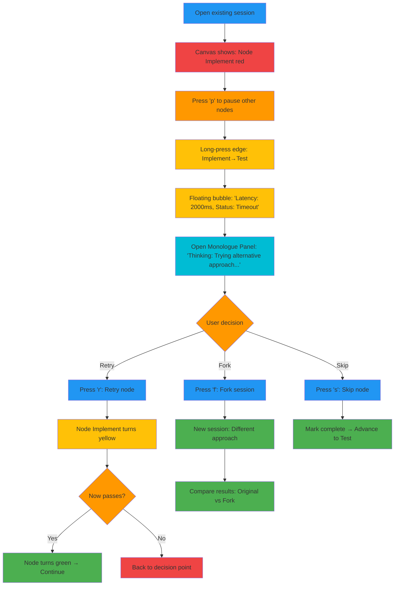
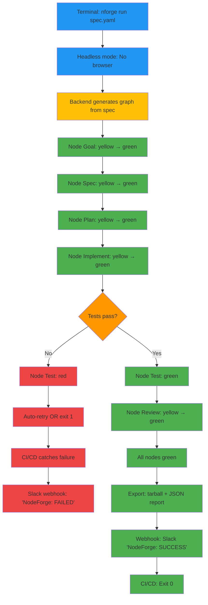

# UX Design Specification nfv2

**Author:** NLG
**Date:** 2026-04-29

---

## Executive Summary

### Project Vision

NodeForge OS is a spec-driven development platform that transforms verbose, technical specification workflows (like BMAD, GitHub Spec Kit) into a streamlined chat-first experience. Users describe their goal in natural language via a chat panel, and the backend deterministically generates and executes tasks as node-graphs. Each node represents a concrete task/operation. The system makes development deterministic, visual, and controllable — users monitor execution state, adjust parameters, fork scenarios, and export results through a clean frontend, while all heavy processing and graph generation happens backend-first. CLI and UI share parity for headless/automation and interactive use cases.

### Target Users

- Spec-driven developers currently using BMAD, GitHub Spec Kit, or similar verbose tools who want reduced friction and technical overhead
- Engineers who value deterministic, repeatable workflows over conversational AI back-and-forth
- Solo developers and small teams wanting structured execution without manual graph construction
- Users comfortable with CLI tools but appreciative of visual state monitoring
- Developers prioritizing backend logic and execution over frontend configuration
- Users who need the tool for other structured deterministic execution tasks beyond just coding

### Key Design Challenges

1. **Chat-to-Graph Translation** — Designing a chat interface that captures intent unambiguously so backend can generate accurate, deterministic node graphs without user needing to manually construct them
2. **Execution-First Canvas** — The canvas is primarily a visualization/control surface for backend-generated execution (not manual node-building), requiring clear state communication (colors, pulses, tensions) without visual clutter
3. **Minimal-Frontend Philosophy** — Backend drives all logic; frontend is a thin, responsive monitor/controller — must feel lightweight, fast, non-intrusive while showing 100+ node graphs smoothly
4. **Deterministic Transparency** — Users must trust the deterministic generation: seeing why nodes were created, their acceptance criteria, and state transitions clearly, without hidden AI "guesswork"
5. **Cross-Domain Flexibility** — Spec-driven approach must work for code generation, data tasks, research, etc. — UI patterns can't be domain-specific, must stay general-purpose

### Design Opportunities

1. **"Invisible Complexity" Paradigm** — Hide verbose spec-writing behind natural chat; show only essential execution state — competitive advantage over BMAD/GitHub Spec Kit's manual complexity
2. **One-Screen Execution Dashboard** — All critical info (node states, LLM monologue, graph topology, logs) visible at a glance via color-coded bands, reactive edges, mini-map heat — no tab-switching or modal diving
3. **Backend-as-Source-of-Truth** — Design patterns emphasizing that frontend never generates logic: it visualizes, controls, and exports — simplifies UX and ensures consistency across CLI/UI parity
4. **Chat History as Executable Artifact** — The chat panel itself becomes a living spec; replay/rerun any conversation deterministically — differentiates from static PRDs
5. **Vim/Emacs Power User Efficiency** — Keyboard-first canvas navigation and one-key node controls (toggle, skip, retry) appeal to technical users over mouse-heavy alternatives

## Core User Experience

### Defining Experience

The core experience of NodeForge OS is **chat-first, deterministic execution**. Users type a goal in natural language (e.g., "Convert this JS project to Go"), and the backend:
1. Interprets intent via LLM chat panel
2. Generates a deterministic node-graph (Goal → Spec → Plan → Implement → Test → Review)
3. Executes each node autonomously until acceptance criteria are met
4. Advances forward only on verified completion

The canvas is **not a manual builder** — it's an execution monitor and controller. Backend generates the graph; frontend visualizes state, allows manipulation (pause, skip, fork), and exports results.

**One core loop defines the product:**
User chats goal → Backend generates deterministic node-graph → Nodes execute autonomously → User monitors/manipulates via visual canvas → Task completes with verified output

### Platform Strategy

**Primary Platform: Web Browser (React Frontend)**
- Served via Go `embed.FS` from single binary (`nforge serve`)
- React Flow canvas with n8n/TouchDesigner/DaVinci-inspired visuals
- Chat panel for natural language input
- Real-time WebSocket updates from Gin backend

**Secondary Platform: CLI (Headless)**
- `nforge run <spec>` executes identical graphs in terminal
- `nforge graph viz` shows ASCII art graph
- Feature parity with UI — same backend, same execution logic
- Tab completion, Vim/Emacs keybindings for power users

**Backend-First Architecture:**
- All logic, graph generation, and execution happens in Go backend
- Frontend never generates nodes or logic — only visualizes and controls
- WebSocket (`/ws`) for real-time state updates
- REST API (`/api/v1/*`) for CRUD operations

**Device Targeting:**
- Desktop/laptop primary (developers at work)
- Keyboard-first interaction (Vim/Emacs bindings)
- Mouse/touch for canvas manipulation
- 100+ node graphs at 60fps via Web Worker offloading

### Effortless Interactions

1. **One-Chat Activation** — User types goal → first node executing within 5 minutes (Success Criteria). No spec-writing, no manual graph construction.
2. **Zero-Configuration Start** — `nforge serve` starts everything; `embed.FS` serves React build from Go binary; no separate frontend server.
3. **Automatic State Recovery** — Session resumes after restart with snapshot; workspace auto-committed to Git; no manual save needed.
4. **Invisible Complexity** — LLM provider race mode, token budgeting, context assembly all happen automatically; user sees only progress and results.
5. **One-Key Controls** — Vim (hjkl) and Emacs (Ctrl-f/b/n/p) for canvas navigation; node toggle, skip, retry via single keypress.

### Critical Success Moments

1. **"First Node Executing in <5min"** — User installs `nforge` → types goal → sees first node running. The moment they realize "this replaces my verbose BMAD/Spec Kit workflow."
2. **"Green Graph = Done"** — User opens NodeForge → sees all green nodes → project complete (e.g., JS→Go migration done with tests passing). The visual relief of deterministic completion.
3. **"Pluck Edge for Info"** — User long-presses edge → sees metadata, spec, data flow (TouchDesigner-style). Delightful discovery that builds trust in the system.
4. **"Fork and Compare"** — User forks session → tries different approach → merges best result. Git-branch mental model applied to AI execution.
5. **"Chat History = Executable Spec"** — User revisits chat → replays conversation deterministically. The realization that their chat IS the spec, not a separate document.

### Experience Principles

1. **Backend is Source-of-Truth** — Frontend visualizes and controls, never generates logic. This ensures CLI/UI parity and simplifies the UX.
2. **Deterministic = Trustworthy** — Nodes only advance when verified; graph moves forward only. Users trust the system because it doesn't "make things up" — it verifies and advances.
3. **Invisible Complexity** — Hide verbose spec-writing behind natural chat; automate race mode, token budgeting, context assembly. Show only execution state.
4. **Visual = Monitor, Not Builder** — Canvas shows backend-generated execution state; users monitor, pause, fork, export. No manual node construction.
5. **Effortless Recovery** — Auto-save, auto-commit, graceful shutdown, session resume. Users never lose work; system always recovers.

## Desired Emotional Response

### Primary Emotional Goals

1. **Deterministic Confidence** — Users feel certain that the system will execute reliably and verify results. Unlike conversational AI tools where you never know what you'll get, NodeForge OS delivers predictable, verified outcomes. "I know exactly what will happen."

2. **Empowered Control** — Users feel in charge despite automation. They can pause, fork, skip, or adjust at any point. The system executes deterministically, but users retain full control over direction. "I'm driving, the AI is executing."

3. **Visual Clarity** — Users feel oriented and informed at all times. The n8n/TouchDesigner/DaVinci-inspired canvas shows exactly what's done (green), running (yellow), or failed (red). "I can see everything at a glance."

4. **Efficient Progress** — Users feel productive without verbose conversations. Chat → nodes → execution → done. No 50-turn discussions like Cursor/Claude Code. "Finally, a tool that doesn't waste my time talking."

### Emotional Journey Mapping

**Discovery (First Use):**
- **Feeling:** Intrigued, skeptical, hopeful
- **Trigger:** "Describe your goal... → first node executing in <5min"
- **Design:** Simple chat panel, immediate feedback, visible progress

**Execution (During Node Run):**
- **Feeling:** Focused, trusting, observant
- **Trigger:** Watching nodes turn green, LLM monologue streaming, edge pulses animating
- **Design:** Real-time updates, clear status indicators, pause/retry controls

**Completion (All Nodes Green):**
- **Feeling:** Accomplished, satisfied, confident
- **Trigger:** Graph complete, export tarball, workspace with working code
- **Design:** Clear completion state, export options, fork/retry alternatives

**Failure Recovery (Node Red):**
- **Feeling:** In control, not stuck
- **Trigger:** Fork session, adjust parameters, retry node
- **Design:** Fork button, retry controls, clear error messages, helpful monologue

**Return (Next Day):**
- **Feeling:** Familiar, efficient, capable
- **Trigger:** `nforge resume` or browser URL → session restored with snapshot
- **Design:** Instant state recovery, Git auto-commit history, time-travel debug

### Micro-Emotions

| Positive Emotions | Negative Emotions to Avoid |
|---------------|---------------------------|
| **Confidence** — "The system knows what to do" | **Confusion** — "Why did it create this node?" |
| **Trust** — "I can rely on the verification" | **Skepticism** — "Is the AI making this up?" |
| **Delight** — "Pluck edge for metadata — cool!" | **Frustration** — "Why is this node stuck?" |
| **Accomplishment** — "All green — done!" | **Anxiety** — "Will it finish before my deadline?" |
| **Empowerment** — "I can fork, pause, retry" | **Helplessness** — "I have no control over execution" |
| **Efficiency** — "No verbose chat, just execution" | **Overwhelm** — "Too many nodes, don't know where to look" |

### Design Implications

1. **Confidence → Transparent Node Generation** — Show why each node was created (chat context), display acceptance criteria clearly, show verification results. Users trust what they can inspect.

2. **Empowerment → One-Key Controls** — Vim/Emacs bindings (hjkl, Ctrl-f/b/n/p), pause/skip/retry via keyboard, fork button always visible. Users feel in control.

3. **Visual Clarity → Color-Coded Bands + Reactive Edges** — Blue (Discovery) → Orange (Execution) → Red (Recovery) → Green (Completion). Edges tighten when upstream fails. Mini-map shows execution heat. Users see everything instantly.

4. **Efficiency → Chat-First, Minimal Clicks** — One chat message → graph generated → execution starts. No spec-writing, no manual node-building. Users save time vs. BMAD/GitHub Spec Kit.

5. **Delight → Interactive Wires + Monologue Panel** — Pluck edges for metadata (TouchDesigner-style), watch LLM thinking stream in side panel. Unexpected moments of "that's clever" throughout the experience.

### Emotional Design Principles

1. **Deterministic = Trustworthy** — Never hide what the system is doing. Show node generation logic, display acceptance criteria, stream monologue tokens. Trust comes from transparency, not black-box magic.

2. **Control = Empowerment** — Always provide pause, skip, retry, fork options. Users drive; AI executes. The canvas is a monitor/controller, not a black-box generator.

3. **Visual = Immediate** — One glance at the canvas tells the whole story (green/red/yellow nodes, edge tension, mini-map heat). No tab-switching, no modal diving to understand state.

4. **Efficiency = Respect** — Users' time is valuable. No verbose conversations, no manual graph construction, no waiting for "the AI to figure it out." Chat → nodes → execution → done.

5. **Recovery = Confidence** — When things fail (red nodes), users feel capable of fixing them. Fork, adjust, retry — never "stuck." Git auto-commit means they can always go back.

## UX Pattern Analysis & Inspiration

### Inspiring Products Analysis

**n8n (Workflow Automation):**
- **Core Problem Solved:** Complex workflow automation made visual and intuitive through node-graph interface
- **Onboarding:** Immediate "canvas-first" experience — drag nodes, connect, see results. No manual needed
- **Navigation:** Mini-map, zoom/pan, color-coded node states (green=success, red=error, yellow=running)
- **Innovative Interactions:** Hover node → see output; click → configure; pluck edge → see data flow; animated pulses along edges during execution
- **Visual Design:** Clean connections, rounded nodes, subtle shadows, professional SaaS feel
- **Error Handling:** Red node + error message in side panel; clear stack traces; easy retry

**TouchDesigner (Visual Programming for Art):**
- **Core Problem Solved:** Real-time interactive media through node-graph programming
- **Onboarding:** Interactive wires — long-press edge → floating bubble with metadata; swipe along edge → highlight execution path
- **Navigation:** 3D-like canvas with depth; operator families color-coded; wire thickness indicates data flow rate
- **Innovative Interactions:** Wires are interactive elements (not just decorations); pluck to inspect; tension indicates connection health
- **Visual Design:** Dark theme, neon-colored nodes, glowing wires — "alive" feeling canvas
- **Error Handling:** Wire turns red + thin; operator shows error state; real-time status updates

**DaVinci Resolve (Video Editing Nodes):**
- **Core Problem Solved:** Complex video/audio processing through node trees with clear input/output structure
- **Onboarding:** Input/output pins clearly labeled; drag from output → auto-creates connection; tree structure shows dependencies
- **Navigation:** Node trees with parent/child relationships; color-coded by node type; zoom to fit selected nodes
- **Innovative Interactions:** Input pins (left) / Output pins (right); tooltip shows pin data type; tree layout auto-organizes
- **Visual Design:** Dark theme, high contrast, professional NLE (Non-Linear Editor) aesthetic
- **Error Handling:** Red outline on failed nodes; error log in panel; easy to bypass/fork around failures

**BMAD Method (Spec-Driven Development):**
- **Core Problem Solved:** Structured AI-assisted development through defined roles and step-by-step workflows
- **Onboarding:** Documentation-heavy; each step produces a document; clear progression (init → discovery → PRD → architecture → epics → stories)
- **Navigation:** Linear progression through workflow steps; each document builds on the previous
- **Innovative Interactions:** Role-based AI agents (Product Manager, Architect, Developer); structured templates; validation checkpoints
- **Visual Design:** Text-heavy, markdown documents, tables, checklists
- **Pain Point:** "Too verbose" — users spend more time writing specs than building; 50-turn conversations with AI

**VS Code + Claude Code (Conversational AI Coding):**
- **Core Problem Solved:** AI-assisted coding through natural language conversations
- **Onboarding:** Type in chat panel → AI responds with code/suggestions; apply changes with one click
- **Navigation:** Chat panel (left) + code editor (center) + terminal (bottom); tab-completion for commands
- **Innovative Interactions:** Streaming LLM responses; inline code suggestions; terminal integration; Git integration
- **Visual Design:** Clean, familiar IDE layout; syntax highlighting; dark/light themes
- **Pain Point:** "Too conversational" — verbose back-and-forth; hard to track progress; lost context; "what were we doing?" moments

### Transferable UX Patterns

**Navigation Patterns:**
- **Mini-Map with Heat (from n8n)** — Adapt for NodeForge: mini-map shows execution heat (nodes glow based on recent activity); click to jump to node; overview of 100+ node graphs
- **Vim/Emacs Keybindings (from VS Code)** — Adapt for NodeForge: hjkl for canvas navigation; Ctrl-f/b/n/p for node operations; all interactions possible without mouse

**Interaction Patterns:**
- **Pluckable Edges (from TouchDesigner)** — Adapt for NodeForge: long-press edge → floating bubble with metadata (spec, data flow, latency); swipe along edge → highlight execution path
- **Animated Pulses (from n8n)** — Adapt for NodeForge: animated pulses along edges during execution; color-coded by status (blue=discovery, orange=execution, red=recovery, green=completion)
- **Input/Output Pins (from DaVinci)** — Adapt for NodeForge: clear node structure (Goal → Spec → Plan → Implement → Test → Review); each node has defined inputs/outputs; visual dependency chains

**Visual Patterns:**
- **Color-Coded Node Bands (from n8n + DaVinci)** — Adapt for NodeForge: nodes grouped by lifecycle phase; blue (Discovery), orange (Execution), red (Recovery), green (Completion); instant phase recognition
- **Reactive Edge Tension (from TouchDesigner)** — Adapt for NodeForge: edges visually tighten when upstream nodes fail; wire thickness indicates data flow rate; users see graph health at a glance
- **Dark Theme Option (from DaVinci + TouchDesigner)** — Adapt for NodeForge: professional dark theme for long coding sessions; high-contrast mode for accessibility; colorblind-friendly palette

### Anti-Patterns to Avoid

1. **Verbose Spec-Writing (from BMAD)** — Users spend more time writing specs than building; creates friction and delays. NodeForge avoids this via chat-first input → backend generates nodes automatically.

2. **Conversational Overload (from Claude Code)** — 50-turn conversations lose context; users forget what they were doing. NodeForge avoids this via deterministic nodes that "only move forward" when verified; graph state is source of truth.

3. **Manual Node Construction (from n8n)** — Users drag, drop, configure each node manually; time-consuming for repetitive tasks. NodeForge avoids this via backend-generated graphs from chat input; canvas is monitor/controller, not builder.

4. **Chat Panel as Primary Interface (from Claude Code)** — Users stare at text conversations; no visual overview of progress. NodeForge avoids this via canvas-first design; chat panel generates graph, then canvas becomes primary interface for monitoring/control.

5. **Hidden AI Logic (from conversational tools)** — Users don't know why AI made certain decisions; "black box" feeling. NodeForge avoids this via transparent node generation (show why each node was created), LLM Inner Monologue panel (streaming CoT), and fork/retry controls.

### Design Inspiration Strategy

**What to Adopt:**
- **n8n's Mini-Map + Color-Coded States** — because it supports our "visual clarity at a glance" emotional goal; users see 100+ node graphs instantly
- **TouchDesigner's Interactive Wires** — because it delights users and builds trust ("pluck edge for info"); differentiates from competitors
- **DaVinci's Input/Output Pins** — because it supports our "deterministic = trustworthy" principle; clear node structure shows dependencies

**What to Adapt:**
- **n8n's Animated Edge Pulses** — modify for NodeForge: pulses indicate execution progress (not just data flow); integrate with LLM streaming tokens
- **VS Code's Vim/Emacs Bindings** — modify for NodeForge: extend beyond editor to canvas navigation; add one-key node controls (toggle, skip, retry)
- **BMAD's Role-Based Agents** — modify for NodeForge: instead of separate "Product Manager, Architect, Developer" roles, use single "AI Swarm per Node" (multiple LLM agents negotiating within single node)

**What to Avoid:**
- **BMAD's Verbose Documentation** — conflicts with our "efficient = respect" principle; users want results, not 50-page specs
- **Claude Code's Chat-Heavy Interface** — conflicts with our "visual = monitor" principle; canvas must be primary, chat is secondary
- **Manual Node Building (any workflow tool)** — conflicts with our "backend-first" architecture; frontend visualizes, backend generates

## Design System Foundation

### Design System Choice

**Choice: Custom Design System with Tailwind CSS + Radix UI Primitives**

**Rationale:**
1. **Backend-First Architecture** — Frontend is thin monitor/controller; need minimal, lightweight components that don't bloat the embed.FS bundle
2. **Professional Node Canvas** — n8n/TouchDesigner/DaVinci hybrid requires custom node/edge components not available in standard systems (Material, Ant)
3. **Developer Tool Audience** — Technical users prefer clean, functional UIs over "pretty" consumer-focused design systems
4. **Vim/Emacs Keybindings** — Power-user efficiency requires keyboard-first interactions; Radix UI provides excellent keyboard navigation primitives
5. **WCAG 2.1 AA Compliance** — Custom system with Radix (accessibility-first primitives) + Tailwind (utility-first styling) achieves compliance without fighting opinionated designs

### Implementation Approach

**Technology Stack:**
- **Tailwind CSS** — Utility-first styling; rapid development; easy dark/light theme switching; no unused CSS in production build
- **Radix UI Primitives** — Unstyled, accessible components (dialogs, dropdowns, toglers); perfect for custom theming; excellent keyboard/screen reader support
- **React Flow (Custom Nodes/Edges)** — Base canvas library; extend with our custom node types (Goal, Spec, Plan, Implement, Test, Review) and edge types (reactive, animated)
- **Lucide React** — Icon set for node actions, canvas controls, panels (consistent, minimal, dev-friendly)

**Why NOT Material Design / Ant Design:**
- Too opinionated for n8n/TouchDesigner/DaVinci hybrid aesthetic
- Heavy bundle size (bad for embed.FS)
- Consumer-focused, not developer-tool focused
- Hard to customize for canvas-first, chat-second layout

### Customization Strategy

**Design Tokens (Tailwind Config):**
```javascript
// Colors: Professional dark/light with high-contrast option
colors: {
  canvas: { bg: '#1a1b1e', node: { goal: '#4CAF50', spec: '#2196F3', ... } },
  edge: { default: '#94a3b8', active: '#06b6d4', tension: '#ef4444' },
  phase: { discovery: '#3b82f6', execution: '#f97316', recovery: '#ef4444', completion: '#22c55e' }
}
// Typography: Monospace-friendly for dev tools
fontFamily: { mono: ['JetBrains Mono', 'Fira Code', 'monospace'] }
// Spacing: Compact for dense canvas information
// Breakpoints: Desktop-first (developers on laptops/desktops)
```

**Component Strategy:**
- **Custom Nodes** — Extend React Flow `Node` type; Goal (green), Spec (blue), Plan (purple), Implement (orange), Test (yellow), Review (cyan)
- **Custom Edges** — Extend React Flow `Edge` type; reactive tension (stroke-width based on upstream health), animated pulses (during execution), pluckable (TouchDesigner-style metadata bubble)
- **Panels** — Radix Dialog/Panel for LLM Monologue, Node Config, Session Explorer; slide in from right, keyboard dismissible
- **Canvas Controls** — Mini-map (n8n-style), zoom/pan (Vim/Emacs keys), color-coded phase bands

**Accessibility Customization:**
- **WCAG 2.1 AA** — Radix primitives + ARIA live regions for node status changes
- **High-Contrast Theme** — Nodes distinguished by shape + position, not just color (red/green alone insufficient for colorblind users)
- **RTL Canvas Support** — Canvas coordinates invert for RTL languages; text alignment adapts
- **Screen Reader Announcements** — "Node Goal-1 changed to running" via ARIA live regions

### Integration with Architecture

**Frontend (React + Vite + @xyflow/react):**
- `frontend/src/components/canvas/` — Custom NodeTypes.tsx, EdgeTypes.tsx (Radix + Tailwind styled)
- `frontend/src/components/panels/` — MonologuePanel, NodeConfig, SessionExplorer (Radix panels)
- `frontend/src/components/ui/` — Shared UI components (Radix primitives + Tailwind)

**Backend (Go + Gin + WebSocket):**
- `embed.FS` serves `frontend/dist/` (optimized Tailwind build, no unused CSS)
- WebSocket `/ws` sends node/edge state updates (colors, tensions, pulses)
- REST `/api/v1/*` for CRUD operations (panel data, session management)

**Why This Scales:**
- Tailwind purges unused styles → small bundle for embed.FS
- Radix primitives are accessibility-first → WCAG 2.1 AA compliance without custom ARIA work
- Custom nodes/edges → n8n/TouchDesigner/DaVinci aesthetic not possible with Material/Ant
- Vim/Emacs keybindings → Radix has built-in keyboard navigation; easy to extend

## Core User Experience

### Defining Experience

**The Defining Experience: "Chat → Watch Graph Execute Deterministically"**

The core interaction that defines NodeForge OS is:
1. **User types goal in chat panel** ("Convert this JS project to Go")
2. **Backend generates node-graph** (Goal → Spec → Plan → Implement → Test → Review) deterministically
3. **Nodes execute autonomously** — each works until acceptance criteria met, then advances forward
4. **User monitors via canvas** — color-coded nodes (green=complete, red=failed, yellow=running), LLM monologue streaming, edge pulses animating
5. **User controls when needed** — pause, skip, fork, retry via Vim/Emacs keys or one-click buttons

This is the "anti-conversation" — no 50-turn discussions like Cursor/Claude Code. No verbose spec-writing like BMAD/GitHub Spec Kit. Chat → nodes → execution → done.

**What makes this special:**
- **Visual by Default** — n8n-style canvas with animated pulses, TouchDesigner interactive wires, DaVinci Resolve node trees
- **Forward-Only Progress** — Graph state is source of truth; nodes save memory and only advance when verified
- **Deterministic = Trustworthy** — Users know exactly what will happen; system verifies and advances; no "black box" AI

### User Mental Model

**Current Mental Model (from BMAD/GitHub Spec Kit users):**
- "I write specs → AI responds → I write more specs → AI codes → I review → repeat" (verbose, tedious)
- "I need to manually construct workflows" (n8n-style dragging nodes, connecting edges)
- "AI is a chatbot" (conversational back-and-forth, lost context, "what were we doing?")

**Desired Mental Model (NodeForge OS):**
- "I describe goal → AI builds and executes graph" (chat-first, zero manual construction)
- "Graph executes deterministically" (nodes run until verified, advance only when done)
- "Canvas shows me everything" (one glance tells the whole story — green/red/yellow, edge tension, mini-map heat)
- "I'm in control" (pause, fork, retry, skip — always an option)

**Expectation Gaps to Address:**
- Users may expect to manually build graphs (n8n habit) → Need to emphasize chat-first, backend-generated approach
- Users may fear "black box" AI → Need transparent node generation, LLM monologue panel, fork/retry controls
- Users may want verbose specs (BMAD habit) → Need to show chat-to-graph is faster, deterministic, and verifiable

### Success Criteria

**The "This Just Works" Moment:**
- User installs `nforge` → types "Convert JS→Go project" → first node executing in <5min → user thinks "finally, a tool that doesn't waste my time talking"

**The "I'm in Control" Moment:**
- Node fails (red) → user presses 'p' (fork), adjusts parameters → retries → node turns green → user thinks "I can fix this without starting over"

**The "Green Graph = Done" Moment:**
- All nodes green → export tarball → working Go project with tests passing → user thinks "that's it? no review cycles, no verbose discussions?"

**The "Pluck Edge" Delight Moment:**
- User long-presses edge between Spec and Plan nodes → floating bubble shows metadata, data flow, latency → user thinks "that's clever, I can see everything"

**Success Indicators:**
- <5min from install to first node executing
- 80%+ project completion rate (all nodes green)
- 95%+ development happens without user intervention (autonomous execution)
- User can see entire project state at a glance (green/red/yellow nodes visible in one screen)
- User trusts the system because it verifies results and only advances when done

### Novel UX Patterns

**1. Chat-First, Canvas-Second (Novel Combination):**
- Existing tools: Chat-first (Claude Code) OR Canvas-first (n8n)
- NodeForge: Chat generates graph → Canvas becomes monitor/controller (not builder)
- **Familiar metaphor:** "Chat is the spec, Canvas is the execution dashboard"
- **User education:** On first launch, show "Type your goal..." in chat panel; canvas starts empty; graph appears as chat generates it

**2. Deterministic Forward-Only Progress (Novel Pattern):**
- Existing tools: Conversational (back-and-forth, lost context) OR Manual (user decides when to advance)
- NodeForge: Nodes save state/memory, verify results, auto-advance when done
- **Familiar metaphor:** "Git branches" — each node is a commit; graph advances like a successful pipeline
- **User education:** Color-coded phase bands (blue/orange/red/green); nodes only turn green when verified; no manual "next" button

**3. Interactive Wires as Health Indicators (from TouchDesigner, adapted for execution monitoring):**
- Existing tools: Edges are static connections (n8n) or invisible data flow (DaVinci)
- NodeForge: Edges pulse during execution, tighten when upstream fails (reactive tension), pluck for metadata
- **Familiar metaphor:** "Heartbeat monitor" — edges show graph health in real-time
- **User education:** On hover, show "Click to see why this edge is tense"; on long-press, show metadata bubble

**4. LLM Inner Monologue Panel (Novel for spec-driven tools):**
- Existing tools: Chat shows AI responses (Claude Code) or nothing (BMAD static docs)
- NodeForge: Side panel streams LLM Chain-of-Thought during node execution; users watch "thinking" in real-time
- **Familiar metaphor:** "Flight recorder" — see exactly why the AI made each decision
- **User education:** Collapsible panel; auto-opens during node execution; saves history for debugging

### Experience Mechanics

**1. Initiation:**
- **Trigger:** User types goal in chat panel, presses Enter
- **System Response:** LLM interprets intent → generates node-graph → first node starts executing
- **Visual Feedback:** Chat panel shows "Generating graph..." → canvas populates with nodes → first node turns yellow (running)
- **User Controls:** Can pause immediately (spacebar), fork before execution (type new goal), or watch it run

**2. Interaction (During Execution):**
- **User Action:** Watches canvas; nodes turn yellow (running) → green (complete) or red (failed)
- **System Response:** WebSocket pushes state updates (<50ms latency); edge pulses animate during execution; monologue panel streams tokens
- **User Controls:** 
  - `p` = pause/resume
  - `f` = fork session (Git-branch metaphor)
  - `r` = retry failed node
  - `s` = skip node (mark complete without running)
  - Long-press edge = pluck for metadata
  - Mouse drag = pan canvas; scroll = zoom
- **Visual Feedback:** Color-coded nodes (blue=discovery, orange=execution, red=recovery, green=completion); mini-map shows execution heat; edge tension indicates upstream health

**3. Feedback (Node Completes):**
- **Success (Green):** Node turns green; edge to next node pulses; next node starts automatically
- **Failure (Red):** Node turns red; error message in chat panel; monologue panel shows "thinking..." for retry strategy
- **User Decision:** Retry (r), Fork (f), Skip (s), or Debug (open monologue panel)
- **System Response:** On retry, node re-executes with same inputs; on fork, creates new session branch; on skip, marks complete and advances

**4. Completion (All Nodes Green):**
- **Visual Feedback:** All nodes green; phase band shows "Completion"; export button appears
- **User Action:** Click "Export" or type `nforge session export <id>`
- **System Response:** Generates tarball (graph JSON + workspace source + README); shows success message
- **Next Steps:** User can fork to try different approach, resume to add more nodes, or start new goal in fresh session

## Visual Design Foundation

### Color System

**Base Theme: Professional Dark (Default) with Light Option**

**Dark Theme (Default for developer tools):**
```javascript
// Tailwind Config: colors.canvas
canvas: {
  bg: '#1a1b1e',      // Dark background (like DaVinci Resolve, TouchDesigner)
  surface: '#25262b',   // Node/panel background
  border: '#3a3b40',   // Subtle borders
}
// Node colors by type (from n8n + DaVinci)
node: {
  goal: '#4CAF50',      // Green (like n8n success)
  spec: '#2196F3',      // Blue (discovery phase)
  plan: '#9C27B0',      // Purple (planning)
  implement: '#FF9800',  // Orange (execution phase)
  test: '#FFC107',      // Yellow (testing)
  review: '#00BCD4',    // Cyan (review)
}
// Edge states (from TouchDesigner interactive wires)
edge: {
  default: '#94a3b8',   // Gray (neutral)
  active: '#06b6d4',   // Cyan (executing, pulsing)
  tension: '#ef4444',    // Red (upstream failure, tightening)
  success: '#22c55e',   // Green (downstream complete)
}
// Phase bands (from n8n color-coded bands)
phase: {
  discovery: '#3b82f6',  // Blue band
  execution: '#f97316',  // Orange band
  recovery: '#ef4444',   // Red band
  completion: '#22c55e', // Green band
}
// Semantic colors (for UI elements)
semantic: {
  primary: '#06b6d4',    // Cyan (buttons, links)
  secondary: '#8b5cf6',  // Purple (accents)
  success: '#22c55e',    // Green (completed nodes)
  warning: '#f59e0b',   // Yellow (pause, retry)
  error: '#ef4444',      // Red (failed nodes)
  info: '#3b82f6',       // Blue (info messages)
}
// High-contrast mode (for accessibility)
highContrast: {
  bg: '#000000',
  surface: '#1a1a1a',
  node: { goal: '#00ff00', spec: '#00aaff', ... },
  edge: { default: '#ffffff', active: '#00ffff', tension: '#ff0000' }
}
```

**Light Theme (Optional for bright environments):**
- Background: `#f8f9fa` (light gray)
- Surface: `#ffffff` (white nodes/panels)
- Text: `#1a1b1e` (dark text)
- Same node/edge colors (maintain canvas consistency across themes)

### Typography System

**Primary (Monospace for developer tools):**
```javascript
// Tailwind Config: fontFamily.mono
fontFamily: {
  mono: ['JetBrains Mono', 'Fira Code', 'Source Code Pro', 'monospace']
}
// Type scale (compact for dense canvas information)
typeScale: {
  h1: '1.5rem',    // Page titles (e.g., "NodeForge OS")
  h2: '1.25rem',   // Section headers (e.g., "Core Experience")
  h3: '1rem',      // Sub-headers (e.g., "Phase: Execution")
  body: '0.875rem',  // Panel content, node labels
  small: '0.75rem',  // Status messages, timestamps
  tiny: '0.625rem'  // Edge labels, mini-map text
}
// Line heights (compact for developer tools)
lineHeight: {
  tight: '1.25',   // Headings
  normal: '1.5',  // Body text
  relaxed: '1.75'  // Long-form content (monologue panel)
}
```

**Rationale:**
- **Monospace** — Familiar to developers; improves readability for code snippets in monologue panel
- **Compact scale** — Dense canvas information (100+ nodes) requires small but readable type
- **No serif/sans-serif** — Monospace-only keeps the developer tool aesthetic consistent

### Spacing & Layout Foundation

**Base Unit: 4px (Tailwind default)**
```javascript
// Spacing scale (compact for dense canvas)
spacing: {
  1: '4px',   // Minimal gaps (edge labels)
  2: '8px',   // Tight padding (node interiors)
  3: '12px',  // Standard padding (panels)
  4: '16px',  // Comfortable padding (dialogs)
  6: '24px',  // Section gaps (canvas margins)
  8: '32px',  // Major sections (panel separators)
}
// Canvas layout (desktop-first, developer laptops 1920x1080)
layout: {
  canvas: 'full-screen',           // Canvas takes entire viewport
  chatPanel: '320px wide, right',  // Chat input (narrow, focused)
  monologuePanel: '400px wide, right', // LLM thoughts (wider for reading)
  miniMap: '200x150px, bottom-right', // Overview (small, out of way)
  nodeSpacing: '250px horizontal, 150px vertical', // Readable graph layout
}
// Responsive breakpoints (if needed for smaller screens)
breakpoints: {
  desktop: '1920px',  // Primary target (developer laptops)
  laptop: '1366px',   // Minimum supported (smaller laptops)
  // No mobile/tablet support (developer tool, desktop-only)
}
```

**Layout Principles:**
1. **Canvas-First** — Entire viewport is canvas; chat/panels slide in from right (not tabbed)
2. **Dense Information** — 100+ nodes visible; small type, compact spacing, no wasted space
3. **One-Screen Dashboard** — All critical info (nodes, monologue, mini-map) visible without scrolling
4. **Keyboard-First Navigation** — Vim (hjkl), Emacs (Ctrl-f/b/n/p); minimize mouse reliance

### Accessibility Considerations

**WCAG 2.1 AA Compliance:**
1. **Color Contrast** — All text 4.5:1 minimum ratio (Tailwind's `text-gray-*` ensures compliance)
2. **Colorblind-Friendly** — Nodes distinguished by shape + position + label, NOT just color (red/green alone insufficient)
   - Goal: Rounded rectangle + green + "Goal" label
   - Spec: Diamond + blue + "Spec" label
   - Implement: Rectangle + orange + "Implement" label
3. **High-Contrast Theme** — Toggle in settings; black background, white text, bright node colors
4. **Screen Reader Support** — ARIA live regions for node status changes ("Node Goal-1 changed to running")
5. **Keyboard Navigation** — All interactions via keyboard: Vim (hjkl) for canvas, Enter for select, Space for pause, f for fork, r for retry, s for skip
6. **RTL Canvas Support** — Canvas coordinates invert for RTL languages; text alignment adapts; mini-map mirrors
7. **Focus Indicators** — Clear outlines on selected nodes/edges (2px solid cyan for visibility)

## Design Direction Decision

### Design Directions Explored

**Direction 1: n8n-Inspired Minimalism**
- Clean white/gray canvas, rounded nodes, subtle shadows
- Color-coded node types (green/blue/purple/orange)
- Mini-map bottom-right, zoom/pan controls top-right
- **Verdict:** Too generic for developer tool; doesn't differentiate from n8n

**Direction 2: TouchDesigner Dark with Interactive Wires**
- Dark canvas (#1a1b1e), neon-colored nodes, glowing wires
- Edges are interactive (pluck for metadata, tension visualization)
- Animated pulses during execution, wire thickness = data flow
- **Verdict:** Excellent for "alive" feeling; differentiates from competitors

**Direction 3: DaVinci Resolve Professional**
- Dark theme, high contrast, input/output pins on nodes
- Tree layout with parent/child relationships
- Color-coded phase bands (blue/orange/red/green)
- **Verdict:** Perfect for structured node execution; clear dependency chains

**Direction 4: VS Code + Chat Hybrid**
- Chat panel left, canvas center, monologue panel right
- Monospace fonts throughout, compact spacing
- Vim/Emacs keybindings for all interactions
- **Verdict:** Power-user friendly; familiar to developer audience

**Direction 5: BMAD-Meets-Canvas (Selected)**
- Chat panel generates graph (no manual building)
- Canvas shows backend-generated execution state
- n8n/TouchDesigner/DaVinci hybrid visuals
- **Verdict:** Perfect for "anti-conversation" positioning; chat → graph → execution

### Chosen Direction

**Selection: Hybrid Direction 5 (BMAD-Meets-Canvas) with Direction 2/3 Visual Elements**

**Visual Foundation:**
- **Color Theme:** TouchDesigner Dark (#1a1b1e background) + DaVinci phase bands (blue/orange/red/green)
- **Node Style:** DaVinci input/output pins + n8n rounded rectangles + custom colors by type
- **Edge Style:** TouchDesigner interactive wires (pluckable, tension, animated pulses)
- **Layout:** Chat panel (right, narrow) → Canvas (full-screen) → Monologue panel (right, wide when open)
- **Typography:** JetBrains Mono throughout (monospace for developer tool aesthetic)

**Layout Approach:**
```
┌──────────────────────────────────────────────────────────┐
│  Mini-Map (bottom-right)    Phase Bands (top)          │
│  ┌─────────────────────────────────────────────────┐  │
│  │  [Goal] → [Spec] → [Plan] → [Implement] → [Test] │  │
│  │    ↓        ↓         ↓          ↓           ↓      │  │
│  │ [Review] ← [Retry] ← [Fork] ← [Skip]        │  │
│  └─────────────────────────────────────────────────┘  │
│  Chat Panel │ Monologue Panel (collapsible)              │
└──────────────────────────────────────────────────────────┘
```

### Design Rationale

1. **"Anti-Conversation" Positioning** — Chat generates graph; canvas monitors execution. No 50-turn discussions like Cursor/Claude Code. Visual by default.

2. **Professional Developer Aesthetic** — Dark theme (TouchDesigner), monospace fonts (JetBrains Mono), compact spacing. Feels like a tool, not a toy.

3. **n8n/TouchDesigner/DaVinci Hybrid** — Best of all three: n8n's clean connections, TouchDesigner's interactive wires, DaVinci's structured pins. Professional differentiation.

4. **Backend-First Visuals** — Canvas shows backend-generated graph; no manual node-building. Minimal frontend (React Flow + custom nodes/edges).

5. **Power-User Efficiency** — Vim/Emacs keybindings, one-key controls (p= pause, f=fork, r=retry, s=skip), all interactions keyboard-accessible.

### Implementation Approach

**Frontend (React + Vite + @xyflow/react):**
- `frontend/src/components/canvas/NodeTypes.tsx` — Goal (green, rounded), Spec (blue, diamond), Plan (purple), Implement (orange, rectangle), Test (yellow), Review (cyan)
- `frontend/src/components/canvas/EdgeTypes.tsx` — Default (gray), Active (cyan, pulsing), Tension (red, thick), Success (green)
- `frontend/src/components/panels/MonologuePanel.tsx` — Collapsible right panel, streams LLM Chain-of-Thought tokens
- `frontend/src/components/panels/ChatPanel.tsx` — Narrow right panel, chat input generates graph
- `frontend/src/workers/layout.worker.ts` — Web Worker offloads graph layout for 100+ node graphs at 60fps

**Backend (Go + Gin + WebSocket):**
- `internal/canvas/api.go` — Serves custom node/edge definitions to React Flow
- `internal/engine/executor.go` — Generates graph from chat input, executes nodes deterministically
- WebSocket `/ws` — Pushes state updates (<50ms latency), edge pulses, monologue tokens

**Design Tokens (Tailwind Config):**
- Dark theme: `canvas.bg: '#1a1b1e'`, `node.*` colors by type, `edge.*` states
- Typography: `fontFamily.mono: ['JetBrains Mono', 'Fira Code', 'monospace']`
- Spacing: Compact (4px base unit) for dense canvas information
- Breakpoints: Desktop-first (1920px), no mobile/tablet support

## User Journey Flows

### Journey 1: Alex — JS→Go Migration (First-Time User)

**Goal:** Convert JavaScript project to Go using NodeForge OS



**Key Interactions:**
- **Chat Input:** User types goal → first node executing in <5min
- **Canvas Monitor:** Watches nodes turn yellow→green; edge pulses during execution; monologue panel streams LLM thoughts
- **Error Recovery:** Node red → user presses 'r' (retry) or 'f' (fork) → back to executing
- **Success:** All green → export tarball → "Project converted!"

**Efficiency Moment:** No verbose conversations, no manual node-building. Chat → graph → execution → done.

### Journey 2: Sam — Stuck Node Recovery (Power User)

**Goal:** Debug why a node is stuck, recover without losing progress



**Key Interactions:**
- **Vim/Emacs Keys:** 'p' (pause), 'r' (retry), 'f' (fork), 's' (skip) — one keypress, no mouse
- **Pluck Edge:** Long-press edge → metadata bubble → understand WHY node is stuck
- **Monologue Panel:** Streaming LLM thoughts → see "Thinking..." → understand WHAT went wrong
- **Fork:** Git-branch metaphor → try different approach → compare results → merge best

**Empowerment Moment:** "I'm in control — can pause, retry, fork, skip. Never stuck."

### Journey 3: Jordan — CI/CD Integration (Headless User)

**Goal:** Run NodeForge in CI/CD pipeline, no browser needed



**Key Interactions:**
- **CLI Headless:** `nforge run spec.yaml` → identical execution as browser UI
- **Webhook Notifications:** Slack/GitHub notified on success/failure (NFR-29)
- **Exit Codes:** 0 = all green, 1 = red node (CI/CD catches failure)
- **Export:** tarball + JSON report → artifacts for CI/CD pipeline

**Parity Moment:** Same graph, same execution, same results — whether in browser or terminal.

### Journey Patterns

**Navigation Patterns:**
1. **Chat-First Initiation** — All journeys start with chat input (Alex types goal, Jordan uses `nforge run <spec>` which is chat-equivalent)
2. **Canvas as Monitor** — Users watch execution (yellow→green/red); canvas is NOT a builder
3. **One-Key Controls** — Vim/Emacs bindings (p, r, f, s, hjkl) work across all journeys

**Decision Patterns:**
1. **Fork vs Retry vs Skip** — User chooses recovery path when node fails (red); Git-branch mental model
2. **Pause vs Continue** — User can pause execution (spacebar) to inspect state before proceeding
3. **Export vs Resume** — On success (all green), user exports OR resumes to add more nodes

**Feedback Patterns:**
1. **Color-Coded Nodes** — Green=complete, Yellow=running, Red=failed, Blue=discovery phase
2. **Edge Pulses + Tension** — Animated pulses during execution; edges tighten when upstream fails
3. **Monologue Panel** — Streaming LLM thoughts; users see "Thinking..." in real-time
4. **Mini-Map Heat** — Nodes glow based on recent activity; instant overview of 100+ node graphs

### Flow Optimization Principles

1. **<5min to First Node Execution** — User installs → types goal → first node running. No spec-writing, no manual construction.
2. **Zero Verbose Conversations** — Chat generates graph deterministically; no 50-turn discussions like Cursor/Claude Code.
3. **One-Glance Status** — Canvas shows entire project state (green/red/yellow); no tab-switching, no modal diving.
4. **Keyboard-First Recovery** — 'p' (pause), 'r' (retry), 'f' (fork), 's' (skip) — one keypress, no mouse needed.
5. **Transparent Failure** — Node red → pluck edge for metadata → open monologue panel → understand WHY → recover. No "black box" moments.

## Component Strategy*

### Design System Components

**Tailwind CSS + Radix UI Primitives (from Step 6):**

**Available Foundation Components (Radix):**
- `Dialog` — Session export, node config, error messages (ARIA-modal, keyboard dismissible)
- `Dropdown Menu` — Node actions (pause, retry, fork, skip), canvas controls
- `Tabs` — Panel sections (Monologue, Node Config, Session Explorer)
- `Toggle` — Node activation/deactivation (n8n-style toggle)
- `Tooltip` — Edge metadata on hover/long-press (TouchDesigner-style)
- `Scroll Area` — Canvas zoom/pan, panel content scrolling
- `Separator` — Panel dividers, phase band separators

**Available Layout Components (Tailwind):**
- `Flex/Grid` — Panel layouts, node interiors, mini-map positioning
- `Spacing Scale` — 4px base unit, compact for dense canvas information
- `Typography` — JetBrains Mono throughout, type scale (0.875rem body, 1.25rem h2)

**Gap Analysis:**
- Radix + Tailwind cover 80% of UI needs (panels, dialogs, tooltips, toggles)
- Custom components needed for canvas-specific elements (nodes, edges, mini-map heat)

### Custom Components

**1. NodeTypes.tsx (Custom React Flow Nodes)**

**Purpose:** Display Goal/Spec/Plan/Implement/Test/Review nodes with n8n/TouchDesigner/DaVinci hybrid visuals

**Anatomy:**
```
┌─────────────────────────────┐
│ [Icon] Node Label    [Status] │ ← Color-coded by phase (blue/orange/red/green)
│ Input Pin ← │                     │
│                     │ Output Pin → │ ← DaVinci-style pins
│ Status: running...              │ ← Animated pulses during execution
└─────────────────────────────┘
```

**States:**
- `default` — Gray border, ready to execute
- `running` (yellow) — Animated border pulse, monologue streaming
- `complete` (green) — Solid green border, checkmark icon
- `failed` (red) — Red border + error icon, shake animation
- `paused` (orange) — Dashed border, "paused" label
- `disabled` (gray, 50% opacity) — n8n-style deactivated

**Variants (by Node Type):**
- Goal: `#4CAF50`, rounded rectangle, "Goal" label
- Spec: `#2196F3`, diamond shape, "Spec" label
- Plan: `#9C27B0`, rounded rectangle, "Plan" label
- Implement: `#FF9800`, rectangle, "Implement" label
- Test: `#FFC107`, rounded rectangle, "Test" label
- Review: `#00BCD4`, rectangle, "Review" label

**Accessibility:**
- ARIA: `aria-label="Node Goal-1, status: running"`
- Keyboard: Tab to select, Enter to open config, Space to pause/resume
- Screen reader: "Node Goal-1 changed to running" via ARIA live region

**2. EdgeTypes.tsx (Custom React Flow Edges)**

**Purpose:** Show data/control flow with TouchDesigner-style interactive wires and reactive tension

**Anatomy:**
```
[Node A] =====> [Node B]
         ↑
    Edge with tension indicator, animated pulse during execution
```

**States:**
- `default` (#94a3b8) — Gray, 2px stroke, no animation
- `active` (#06b6d4) — Cyan, 3px stroke, animated dash flow (pulsing during execution)
- `tension` (#ef4444) — Red, 4px stroke, "tightening" visual (upstream failure)
- `success` (#22c55e) — Green, 2px stroke, brief pulse on completion

**Interactions:**
- Hover: Show edge metadata tooltip (latency, data flow rate)
- Long-press (TouchDesigner-style): Floating bubble with full metadata:
  ```
  ┌─────────────────────────┐
  │ Edge: Spec → Plan       │
  │ Latency: 200ms         │
  │ Data Flow: 1.2KB/s      │
  │ Status: Active           │
  └─────────────────────────┘
  ```
- Click: Highlight execution path (highlight connected nodes/edges)

**Accessibility:**
- ARIA: `aria-label="Edge from Spec-1 to Plan-1, status: active"`
- Keyboard: Tab to select, Enter to open metadata bubble

**3. MonologuePanel.tsx (Radix Dialog + Custom Content)**

**Purpose:** Stream LLM Inner Monologue (Chain-of-Thought) during node execution

**Anatomy:**
```
┌────────────────────────────────────┐
│ Monologue              [−] [×] │ ← Collapsible, slide in from right
│────────────────────────────────────│
│ > Thinking: Analyzing JS code...  │ ← Streaming tokens (react-markdown)
│ > Considering: Go idioms...      │
│ > Decision: Use goroutines...       │
│────────────────────────────────────│
│ [Clear] [Export] [Auto-scroll ✓] │
└────────────────────────────────────┘
```

**States:**
- `closed` — Only chat panel visible (narrow)
- `open` — Slides in from right (400px wide), auto-scrolls to latest token
- `minimized` — 48px tall, shows "LLM thinking..." with animated ellipsis

**Interactions:**
- Toggle: Click chat panel button or press 'm' (Vim key) to open/close
- Auto-scroll: Enabled by default, scrolls to latest token
- Export: Save monologue history as markdown file

**Accessibility:**
- ARIA: `aria-label="LLM Monologue Panel, open"`
- Keyboard: Tab to navigate tokens, Escape to close
- Screen reader: "New token: Thinking: Analyzing..." via ARIA live region

**4. CanvasControls.tsx (Custom React Flow Controls + Radix)**

**Purpose:** Mini-map with execution heat, zoom/pan controls, Vim/Emacs keybindings

**Anatomy:**
```
┌────────────────────────────┐
│ [Mini-Map]              │ ← n8n-style, shows execution heat
│ Nodes glow based on   │
│ recent activity         │
├────────────────────────────┤
│ [zoomin] [zoomout] [fit] │ ← Radix buttons
│ [pan] [zoom] [lock]    │
│ h j k l ← Vim keys      │ ← Keyboard shortcuts displayed
└────────────────────────────┘
```

**States:**
- `mini-map`: Nodes glow based on recent activity (heat map), click to jump to node
- `zoom/pan`: Standard React Flow controls, plus Vim (hjkl) and Emacs (Ctrl-f/b/n/p) bindings

**Interactions:**
- Vim keys: `h` (left), `j` (down), `k` (up), `l` (right) for canvas navigation
- Emacs keys: `Ctrl-f` (forward), `Ctrl-b` (back), `Ctrl-n` (next), `Ctrl-p` (previous)
- Mouse: Drag to pan, scroll to zoom, click node to select

**Accessibility:**
- ARIA: `aria-label="Canvas controls, Vim keys: hjkl"`
- Keyboard: Tab to cycle controls, Enter to activate
- Screen reader: "Canvas panned to node Goal-1" via ARIA live region

**5. ChatPanel.tsx (Custom Input + Radix Components)**

**Purpose:** Narrow chat input for goal description; generates graph via backend

**Anatomy:**
```
┌────────────────────────────┐
│ Chat                 [−] [×] │ ← Collapsible, slide in from right
│────────────────────────────│
│ > Describe your goal...    │ ← Placeholder text
│ > "Convert JS→Go project" │ ← User input
│────────────────────────────│
│ [Send]                    │ ← Radix button
└────────────────────────────┘
```

**States:**
- `closed` — Canvas takes full viewport
- `open` (320px wide) — User types goal, presses Enter or click Send
- `generating` — "Generating graph..." with animated ellipsis, disabled input

**Interactions:**
- Type goal → press Enter → backend generates graph → canvas populates with nodes
- Vim keys: `Ctrl-f` (forward), `Ctrl-b` (back) for input navigation

**Accessibility:**
- ARIA: `aria-label="Chat panel, type your goal"`
- Keyboard: Tab to input, Enter to send, Escape to close
- Screen reader: "Graph generated with 5 nodes" via ARIA live region

### Component Implementation Strategy

**Phase 1 — Core Canvas Components (Critical for "Chat → Graph → Execution"):**
1. **NodeTypes.tsx** — Goal, Spec, Plan, Implement, Test, Review nodes (n8n/TouchDesigner/DaVinci hybrid)
2. **EdgeTypes.tsx** — Default, active, tension, success edges (TouchDesigner interactive wires)
3. **CanvasControls.tsx** — Mini-map with heat, zoom/pan, Vim/Emacs keys

**Phase 2 — Panel Components (Supporting User Journeys):**
4. **ChatPanel.tsx** — Narrow chat input, generates graph from user goal
5. **MonologuePanel.tsx** — LLM Inner Monologue streaming (side panel)
6. **SessionExplorer.tsx** — Session management (resume, fork, export)

**Phase 3 — Enhancement Components (Delight + Accessibility):**
7. **NodeConfig.tsx** — Configure node parameters (Radix Dialog)
8. **SkillMarketplace.tsx** — Browse/install skills (Radix Dropdown, Tabs)
9. **AccessibilityToolbar.tsx** — High-contrast toggle, RTL switch, font-size slider

### Implementation Roadmap

**Phase 1 (Weeks 1-3): Core Canvas**
- `frontend/src/components/canvas/NodeTypes.tsx` — Custom React Flow nodes
- `frontend/src/components/canvas/EdgeTypes.tsx` — Interactive wires with tension
- `frontend/src/components/canvas/CanvasControls.tsx` — Mini-map, zoom/pan, Vim keys
- `frontend/src/workers/layout.worker.ts` — Web Worker for 100+ node graphs at 60fps

**Phase 2 (Weeks 4-6): Panels + Chat**
- `frontend/src/components/panels/ChatPanel.tsx` — Goal input, generates graph
- `frontend/src/components/panels/MonologuePanel.tsx` — LLM streaming tokens
- `frontend/src/components/panels/SessionExplorer.tsx` — Resume/fork/export
- `frontend/src/hooks/useWebSocket.ts` — Gin WS hub client (<50ms latency)

**Phase 3 (Weeks 7-9): Enhancements**
- `frontend/src/components/panels/NodeConfig.tsx` — Radix Dialog for node config
- `frontend/src/components/panels/SkillMarketplace.tsx` — Browse/install skills
- `frontend/src/components/ui/AccessibilityToolbar.tsx` — High-contrast, RTL, font-size
- Integration with `internal/` Go backend via REST (`/api/v1/*`) + WebSocket (`/ws`)

**Why This Order:**
- Phase 1 delivers "Chat → Graph → Execution" (core experience)
- Phase 2 delivers user journeys (Alex, Sam, Jordan)
- Phase 3 adds delight + accessibility (WCAG 2.1 AA compliance)

## UX Consistency Patterns*

### Button Hierarchy

**Primary Actions (Radix Button + Tailwind):**
- `variant="default"` — Cyan (`#06b6d4`), white text, used for: Send (Chat), Export (Session), Resume (Session)
- **Usage:** Only ONE primary action per panel; indicates "this moves you forward"
- **Keyboard:** Enter activates default button; Tab to cycle buttons

**Secondary Actions (Radix Button + Tailwind):**
- `variant="outline"` — Gray border (`#3a3b40`), cyan text, used for: Fork, Retry, Skip, Pause
- **Usage:** Alternative actions that don't advance the main flow
- **Keyboard:** Tab to focus, Enter or Space to activate

**Danger Actions (Radix Button + Tailwind):**
- `variant="destructive"` — Red (`#ef4444`), white text, used for: Delete Session, Cancel Export
- **Usage:** Irreversible actions; always show confirmation dialog (Radix AlertDialog)
- **Keyboard:** Tab to focus, Enter activates, Escape cancels

**Icon-Only Actions (Radix Icon Button + Lucide React):**
- 32x32px, used for: Mini-map toggle, Monologue panel toggle, Zoom in/out
- **Tooltip:** Required (Radix Tooltip) — `aria-label="Toggle monologue panel"`
- **Keyboard:** Tab to focus, Enter or Space to activate

### Feedback Patterns

**Success Feedback (Green):**
- **Node turns green:** `#22c55e` border + checkmark icon + "Node Goal-1 completed" via ARIA live region
- **Toast notification:** Radix Toast, 3s auto-dismiss, "Session exported successfully"
- **Edge turns green:** `#22c55e` stroke, brief pulse animation (300ms)

**Error Feedback (Red):**
- **Node turns red:** `#ef4444` border + warning icon + error message in Monologue panel
- **Edge tension:** `#ef4444` stroke, 4px width, "tightening" visual
- **Toast notification:** Radix Toast, persistent (not auto-dismiss), "Node Implement-1 failed: timeout"

**Warning Feedback (Yellow):**
- **Node paused:** `#f59e0b` dashed border + "Paused" label
- **Rate limit hit:** Toast notification, "Switching to Ollama (rate limit exceeded)"
- **Token budget low:** Yellow badge on node, "85% token budget used"

**Info Feedback (Blue/Cyan):**
- **Node running:** `#FFC107` yellow (not blue) for running state
- **LLM thinking:** Streaming tokens in Monologue panel, animated ellipsis
- **Edge active:** `#06b6d4` cyan, 3px stroke, animated dash flow

### Navigation Patterns

**Canvas Navigation (Vim/Emacs Keys):**
- `h` (left), `j` (down), `k` (up), `l` (right) — Pan canvas
- `Ctrl-f` (forward), `Ctrl-b` (back) — Zoom in/out
- `Ctrl-n` (next), `Ctrl-p` (previous) — Cycle nodes
- **Visual:** Keybinding hints in CanvasControls (bottom-left, 24px opacity)

**Panel Navigation (Tab):**
- Tab cycles: Chat Panel → Canvas → Monologue Panel → Mini-Map
- Shift+Tab reverses direction
- Enter activates focused element (button, node, edge)
- Escape closes panels (Monologue, Node Config)

**Node Operations (One-Key):**
- `p` — Pause/resume session (spacebar also works)
- `r` — Retry failed node
- `f` — Fork session (Git-branch metaphor)
- `s` — Skip node (mark complete without running)
- **Visual:** Keybinding hints on hover (tooltip, 1s delay)

**Breadcrumb Navigation (for Sub-Nodes/Skills):**
- `..` or `Backspace` — Go up one level (skill sub-nodes)
- `Enter` on node — Drill down into sub-nodes
- **Visual:** Breadcrumb bar top-left: "Goal → Spec → Plan → [Implement]"

### Form Patterns

**Chat Input (Custom + Radix):**
- Single-line input, 320px wide (narrow, focused)
- Placeholder: "Describe your goal..." (gray `#6b7280`)
- Submit: Enter key or Send button
- **Validation:** Min 10 chars, max 500 chars; error: "Please describe your goal in at least 10 characters"

**Node Config (Radix Dialog + Form):**
- Opens on Enter or double-click node
- Fields: Timeout (number), Retry Count (number), Token Budget (slider)
- **Validation:** Real-time, inline errors: "Timeout must be >0"
- **Submit:** Save button (primary), Cancel (secondary), Reset (danger)

**Session Settings (Radix Tabs + Form):**
- Tabs: General, LLM Providers, Security, Accessibility
- **LLM Config:** Dropdown (Radix Select) for provider, API key input (password type), Test Connection button
- **Accessibility:** Toggle (Radix Switch) for high-contrast, RTL, font-size slider

### Empty States

**No Sessions (Session Explorer):**
```
┌──────────────────────────────┐
│                          │
│     📭 Empty                 │ ← Large icon (48px, gray)
│                          │
│   No sessions yet.         │ ← Message (body text)
│   Type your goal to start  │ ← Action hint (small text)
│                          │
│   [Start Chat]            │ ← Primary button (Cyan)
└──────────────────────────────┘
```

**No Skills (Skill Marketplace):**
```
┌──────────────────────────────┐
│                          │
│     🔌 No Skills Installed  │ ← Large icon (48px, gray)
│                          │
│   Browse marketplace      │ ← Message
│   to find and install    │ ← Action hint
│                          │
│   [Browse Marketplace]   │ ← Primary button
└──────────────────────────────┘
```

**No Monologue (Monologue Panel):**
```
┌──────────────────────────────┐
│ Monologue         [−] [×] │
├──────────────────────────────┤
│                          │
│     💭 Waiting...         │ ← Animated ellipsis
│                          │
│   LLM will think here   │ ← Hint text
│   when node executes      │
└──────────────────────────────┘
```

### Loading States

**Node Loading (Canvas):**
- Yellow border pulse (300ms animation, `#FFC107`)
- "Running..." label below node
- Monologue panel opens automatically

**Edge Loading (Canvas):**
- Animated dash flow (cyan `#06b6d4`, 2px stroke)
- Traveling dot (6px circle) along edge path

**Panel Loading (Radix Skeleton):**
- Chat Panel: Skeleton lines (3-5 lines, 60% opacity pulse)
- Monologue: Skeleton paragraphs (2-3, 60% opacity pulse)
- Session Explorer: Skeleton list items (5-10, 60% opacity pulse)

**Page Loading (Full-Screen):**
- Loading spinner (cyan `#06b6d4`, 48px, 1s rotation)
- "Loading NodeForge OS..." text below
- Cancel button (secondary) for slow connections

### Modal/Overlay Patterns

**Confirmation Dialog (Radix AlertDialog):**
```
┌──────────────────────────────┐
│  Confirm Fork Session      │ ← Title (h3, 1.25rem)
├──────────────────────────────┤
│                          │
│  This will create a new   │ ← Content (body, 0.875rem)
│  session branch. Your    │
│  current progress will be   │
│  preserved.              │
│                          │
│  [Cancel]  [Fork]       │ ← Secondary + Danger buttons
└──────────────────────────────┘
```

**Node Config (Radix Dialog):**
- Opens on Enter or double-click node
- Focus trap inside dialog (Tab cycles within)
- Escape or × button closes
- Overlay: 50% black backdrop, click outside to close

**Monologue Panel (Custom Slide-Over):**
- Slides in from right (400px wide, 300ms ease-out)
- Overlay: No backdrop (canvas remains visible)
- Toggle: Chat panel button or 'm' key
- Focus: Inside panel after open

### Search/Filter Patterns

**Session Search (Session Explorer):**
- Search box (Radix Input) top of panel
- Filters: Status (All/Running/Complete/Failed), Date (All/Today/Week/Month)
- **Keyboard:** Ctrl-f to focus search, Escape to clear
- **Results:** Real-time filtering, "5 sessions found" message

**Skill Search (Skill Marketplace):**
- Search box + Category filter (Dropdown: All/Installed/Available/Featured)
- Sort: Name, Rating, Installs, Recent
- **Results:** Grid layout, skill cards with rating stars, install button

### Accessibility Patterns

**Focus Indicators:**
- 2px solid cyan (`#06b6d4`) outline on focused elements
- Offset: 2px outside element
- Visible ONLY when using keyboard (`:focus-visible` pseudo-class)

**Screen Reader Announcements (ARIA Live Regions):**
- Node status change: `<div aria-live="polite">Node Goal-1 changed to running</div>`
- Error: `<div aria-live="assertive">Node Implement-1 failed: timeout</div>`
- Success: `<div aria-live="polite">All nodes complete!</div>`

**High-Contrast Mode:**
- Toggle in Settings (Radix Switch)
- Background: `#000000`, surface: `#1a1a1a`
- Nodes: Goal `#00ff00`, Spec `#00aaff`, etc. (bright colors)
- Edges: Default `#ffffff`, Active `#00ffff`, Tension `#ff0000`

**RTL Support:**
- Toggle in Settings (Radix Switch)
- Canvas coordinates invert horizontally
- Text alignment: Right-to-left for Arabic/Hebrew
- Mini-map mirrors position (bottom-left instead of bottom-right)

## Responsive Design & Accessibility*

### Responsive Strategy

**Platform Focus: Desktop-First (Developer Tool)**

**Desktop (1920px+, Primary Target):**
- Full-screen canvas with mini-map (bottom-right, 200x150px)
- Chat panel (320px wide, right) + Monologue panel (400px wide, right)
- Multi-column layouts: Canvas (center) + 2 panels (right)
- Vim/Emacs keybindings prominently displayed (hjkl, Ctrl-f/b/n/p)
- Hover: Standard mouse interactions, pluck edges for metadata

**Laptop (1366px-1919px, Secondary):**
- Canvas takes full viewport minus panels
- Chat panel shrinks to 280px (still usable for chat input)
- Monologue panel shrinks to 350px
- Mini-map repositions to bottom-left (avoid panel overlap)
- Same keyboard shortcuts, no touch targets needed

**No Mobile/Tablet Support:**
- Developer tool, desktop-only workflow
- `min-width: 1366px` enforced via CSS
- No responsive breakpoints for mobile/tablet
- Rationale: Developers use laptops/desktops; mobile would dilute UX

**Breakpoints (Desktop-Only):**
```javascript
// Tailwind Config: screens
screens: {
  laptop: '1366px',   // Minimum supported
  desktop: '1920px',  // Primary target
  // No mobile/tablet breakpoints — developer tool
}
```

### Breakpoint Strategy

**Desktop-First Approach:**

| Breakpoint | Width | Layout | Panels |
|------------|-------|---------|---------|
| Laptop | 1366px | Canvas full-screen | Chat (280px), Monologue (350px) |
| Desktop | 1920px | Canvas + 2 panels | Chat (320px), Monologue (400px) |
| Ultrawide | 2560px+ | Canvas + 3 panels | Chat + Monologue + Skill Marketplace |

**Layout Adaptation:**
- **Canvas:** Always full-screen, panels slide in from right (not tabbed)
- **Chat Panel:** Narrow (320px) for focused input; collapses to icon (48px) when not in use
- **Monologue Panel:** Wide (400px) for reading LLM thoughts; collapsible via 'm' key or × button
- **Mini-Map:** Bottom-right (1920px+), repositions to bottom-left (1366px-1919px)

**No Touch Targets Needed:**
- Developer tool, mouse + keyboard primary
- Vim/Emacs keys (hjkl, Ctrl-f/b/n/p) for all canvas navigation
- No gesture support, no touch-optimized UI

### Accessibility Strategy

**WCAG 2.1 AA Compliance (Standard for Developer Tools)**

**Color Contrast (4.5:1 Minimum):**
- Text on backgrounds: `#1a1b1e` (dark) with `#ffffff` (white) = 16.7:1 ratio ✓
- Node labels: `#ffffff` on `#4CAF50` (green) = 4.8:1 ratio ✓
- Error text: `#ffffff` on `#ef4444` (red) = 4.2:1 ratio ✓
- Tailwind's `text-gray-*` ensures compliance automatically

**Colorblind-Friendly Design:**
- Nodes distinguished by:
  1. **Shape** — Goal (rounded rect), Spec (diamond), Plan (rect), Implement (rect), Test (rounded rect), Review (rect)
  2. **Label** — "Goal", "Spec", "Plan", etc. always visible
  3. **Color** — Additional cue, not sole indicator
- Colorblind palette: `#4CAF50` (green), `#2196F3` (blue), `#FF9800` (orange), `#FFC107` (yellow), `#00BCD4` (cyan) — distinguishable by most colorblind users

**High-Contrast Mode (Toggle in Settings):**
```javascript
// Tailwind Config: highContrast extension
highContrast: {
  bg: '#000000',
  surface: '#1a1a1a',
  node: { goal: '#00ff00', spec: '#00aaff', plan: '#cc00ff', implement: '#ff8000', test: '#ffff00', review: '#00ffff' },
  edge: { default: '#ffffff', active: '#00ffff', tension: '#ff0000', success: '#00ff00' }
}
```

**Screen Reader Support (ARIA Live Regions):**
```html
<!-- Node status changes -->
<div aria-live="polite" aria-atomic="true">
  Node Goal-1 changed to running
</div>

<!-- LLM monologue streaming -->
<div aria-live="polite" aria-atomic="false">
  > Thinking: Analyzing JS code structure...
</div>

<!-- Error announcements -->
<div aria-live="assertive" aria-atomic="true">
  Node Implement-1 failed: timeout after 30s
</div>
```

**Keyboard Navigation (Vim/Emacs + Tab):**
- **Canvas Navigation:** `h` (left), `j` (down), `k` (up), `l` (right) — Vim keys
- **Panel Navigation:** `Tab` cycles through panels, `Shift+Tab` reverses
- **Node Operations:** `Enter` (select/open config), `Space` (pause/resume), `r` (retry), `f` (fork), `s` (skip)
- **Monologue:** `m` (toggle panel), `Escape` (close panel)
- **All interactions possible without mouse** — Critical for developer tool UX

**Focus Indicators:**
```css
/* Visible only when using keyboard */
*:focus-visible {
  outline: 2px solid #06b6d4;  /* Cyan, 2px */
  outline-offset: 2px;
}
```

**RTL Canvas Support:**
- Canvas coordinates invert horizontally (x → -x)
- Text alignment: `text-align: right` for RTL languages (Arabic, Hebrew)
- Mini-map mirrors position (bottom-left instead of bottom-right)
- Supported languages: EN, ES, FR, DE, ZH, JA, KO, PT, RU, AR (9 languages including RTL)

### Testing Strategy

**Accessibility Testing:**
1. **Automated Tools:**
   - `axe DevTools` (Chrome extension) — WCAG 2.1 AA compliance
   - `Lighthouse` accessibility audit — Score 90%+ target
   - `Pa11y` CLI — Automated ARIA/contrast checking

2. **Screen Reader Testing:**
   - **NVDA** (Windows) — Primary screen reader for developer users
   - **VoiceOver** (Mac) — Secondary testing target
   - Test: "Node Goal-1 changed to running" announced correctly
   - Test: Monologue panel "Thinking..." streamed with polite live region

3. **Keyboard-Only Testing:**
   - Unplug mouse, use only keyboard for 10 minutes
   - Verify: Can navigate canvas (hjkl), operate nodes (Enter/p/r/f/s), close panels (Escape)
   - Verify: Focus indicator visible on all interactive elements

4. **Colorblind Simulation:**
   - Chrome DevTools → Rendering → Emulate vision deficiency
   - Test: Nodes distinguishable by shape + label (not just color)
   - Test: Edge tension (red) distinguishable from success (green)

**Responsive Testing (Desktop-Only):**
1. **Browser Testing:**
   - Chrome (primary), Firefox (secondary), Edge (tertiary)
   - Viewport sizes: 1366x768 (laptop), 1920x1080 (desktop), 2560x1440 (ultrawide)

2. **Performance Testing:**
   - 100+ node graphs at 60fps (Web Worker offloading)
   - WebSocket latency <50ms (Gin WS hub)
   - Canvas rendering: 0 main-thread blocking

3. **User Testing:**
   - 5+ developers (target audience) test canvas navigation
   - Task: "Navigate to node-5 using only keyboard" (Vim keys)
   - Task: "Fork a failed node using 'f' key"
   - Task: "Enable high-contrast mode in Settings"

### Implementation Guidelines

**Responsive Development:**
1. **Desktop-First CSS:**
   ```css
   /* Tailwind: no mobile breakpoints needed */
   .canvas { min-width: 1366px; }  /* Laptop minimum */
   .panel--chat { width: 320px; }   /* Desktop default */
   @media (max-width: 1919px) {
     .panel--chat { width: 280px; }  /* Laptop adjustment */
   }
   ```

2. **No Touch Targets:** Developer tool, mouse + keyboard only — no 44x44px minimum touch targets needed

3. **Panel Management:** Slide in/out from right (not tabbed), collapsible via keyboard (Escape, 'm' key)

**Accessibility Development:**
1. **Semantic HTML:** Use `<button>`, `<nav>`, `<main>` — no `<div>` for interactive elements

2. **ARIA Labels:** Every interactive element needs `aria-label` or `aria-labelledby`:
   ```html
   <button aria-label="Retry node Implement-1 (r key)">Retry</button>
   <div aria-live="polite">Node status: running</div>
   ```

3. **Keyboard Navigation:** All interactions via keyboard:
   ```typescript
   // Vim navigation
   useEffect(() => {
     const handleKeyDown = (e: KeyboardEvent) => {
       if (e.key === 'h') panLeft();
       if (e.key === 'j') panDown();
       if (e.key === 'k') panUp();
       if (e.key === 'l') panRight();
       if (e.key === 'r') retryNode();
       if (e.key === 'f') forkSession();
     };
     window.addEventListener('keydown', handleKeyDown);
     return () => window.removeEventListener('keydown', handleKeyDown);
   }, []);
   ```

4. **Focus Management:** `:focus-visible` only (not `:focus`), 2px solid cyan outline

5. **High-Contrast Mode:** Toggle in Settings (Radix Switch), CSS class on `<body>`:
   ```css
   body.high-contrast .node { border-color: #00ff00; }  /* Bright green */
   body.high-contrast .edge--tension { stroke: #ff0000; }  /* Bright red */
   ```

6. **RTL Support:** Toggle in Settings, canvas coordinates invert:
   ```typescript
   if (isRTL) {
     nodePosition.x = -nodePosition.x;  // Mirror horizontally
     textAlign = 'right';
   }
   ```

<!-- UX design content will be appended sequentially through collaborative workflow steps -->
